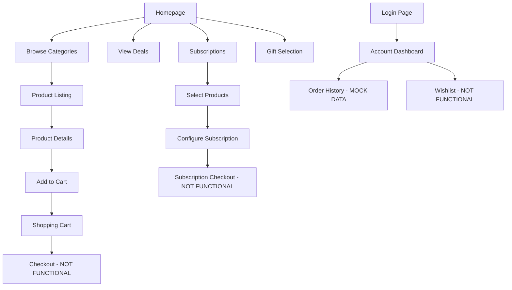

# 🐾 Pawsome Frontend - Comprehensive Site Analysis & Documentation

## 📊 Executive Summary

**Date**: December 28, 2024  
**Project**: Pawsome E-commerce Frontend  
**Status**: Frontend Prototype - Backend Integration Pending  
**Version**: 1.2.0

This document provides a comprehensive analysis of the Pawsome e-commerce frontend, including current functionality, identified issues, and recommendations for completion.

---

## 🌐 Site Flow Analysis

### 1. **User Journey Flow**



### 2. **Current Working Features**

#### ✅ **Fully Functional**
- Homepage with 3D interactive animations
- Product browsing by category
- Product detail views
- Visual cart management (add/remove/quantity)
- Subscription product selection
- Gift customization interface
- Responsive navigation
- Newsletter signup UI
- Contact form UI

#### ⚠️ **Partially Functional**
- Shopping cart (not using global state)
- Search bar (UI only, no search logic)
- Filter sidebar (UI only, no filtering)
- User account page (mock data only)
- Loyalty cards page (static content)

#### ❌ **Non-Functional (UI Only)**
- User authentication/login
- Checkout process
- Payment processing
- Order placement
- Wishlist functionality
- Product reviews submission
- API calls/backend communication
- Data persistence

---

## 🔍 Detailed Component Analysis

### 3. **Navigation & Routing**

**Current Routes**: 18 routes implemented
```javascript
// Main Navigation
/                    - Home (3D Experience)
/subscriptions       - Subscription Service ✅
/gifts              - Gift Selection ✅
/deals              - Daily Deals ✅
/loyalty-cards      - Paw Rewards ⚠️

// Category Routes
/dogs               - Dog Products ✅
/cats               - Cat Products ✅
/birds              - Bird Products ✅
/other-animals      - Other Pets ✅
/vet-diet           - Veterinary Diet ❌ (No products)

// Feature Routes
/cart               - Shopping Cart ⚠️
/account            - User Dashboard ⚠️
/login              - Authentication ❌
/contact            - Contact Form ⚠️
/product/:id        - Product Details ✅
/deals/:slug        - Deal Details ✅
/gifts/customize    - Gift Customizer ✅
```

### 4. **State Management Issues**

#### **CartContext Implementation**
```typescript
// Context exists but not fully utilized
interface CartContextType {
  cart: CartItem[]
  addItem: (item: Product) => void
  removeItem: (id: number) => void
  updateQuantity: (id: number, quantity: number) => void
  clearCart: () => void
  totalItems: number
  totalPrice: number
}
```

**Problem**: Cart.tsx component uses local state instead of CartContext

#### **Missing State Management**
- User authentication state
- API loading states
- Error states
- Form validation states
- Search/filter states

### 5. **Data Flow Problems**

```
Current Flow:
Component Mount → Load Mock Data → Display

Required Flow:
Component Mount → API Call → Loading State → Success/Error → Display Data
```

---

## 🐛 Critical Issues & Bugs

### 6. **High Priority Issues**

| Issue | Component | Impact | Fix Required |
|-------|-----------|---------|--------------|
| No Backend Integration | All | Cannot persist data | Implement API service layer |
| Cart State Mismatch | Cart.tsx | Cart data inconsistent | Use CartContext properly |
| No Authentication | Login/Account | No user management | Implement auth system |
| No Data Persistence | All | Data lost on refresh | Add localStorage/API |
| Mixed File Types | Various | TypeScript errors | Convert .js to .tsx |
| No Error Boundaries | App-wide | Poor error handling | Implement error boundaries |

### 7. **TypeScript Errors**

Common TypeScript errors throughout the codebase:
```typescript
// Property does not exist on type 'never'
// This occurs in arrays that aren't properly typed
const [products, setProducts] = useState([]) // Should be: useState<Product[]>([])

// Implicit any types
const handleClick = (product) => {} // Should specify: (product: Product)
```

### 8. **Missing E-commerce Features**

#### **Essential Features Not Implemented**
1. **Search Functionality**
   - Search bar exists but doesn't work
   - No search algorithm or filtering
   - No search results page

2. **Product Filtering**
   - Filter UI exists but non-functional
   - No price range filtering
   - No brand filtering
   - No rating filtering

3. **User Features**
   - No user registration
   - No password reset
   - No order history (real)
   - No address management
   - No payment methods saved

4. **Checkout Flow**
   - No shipping address form
   - No payment method selection
   - No order summary
   - No order confirmation

5. **Admin Features**
   - No product management
   - No inventory tracking
   - No order management
   - No customer management

---

## 🔧 Technical Debt

### 9. **Code Quality Issues**

```javascript
// Example: Hardcoded values throughout
const shipping = total > 20000 ? 0 : 150; // Should be configurable

// Example: Mock data in components
const mockSubscriptions = [
  { id: 1, name: 'Premium Dog Food Bundle' }
  // Should fetch from API
]

// Example: Inline styles mixed with Tailwind
style={{ backgroundColor: '#FF914D' }} // Should use Tailwind classes
```

### 10. **Performance Concerns**

1. **Bundle Size**: ~408KB gzipped (can be optimized)
2. **No Code Splitting**: Beyond route-level
3. **External Image URLs**: Loading from Amazon/external sources
4. **No Image Optimization**: Full-size images loaded
5. **No Lazy Loading**: For images or components

---

## 📋 Implementation Roadmap

### 11. **Phase 1: Foundation (Week 1-2)**

```
□ Set up backend API (Node.js/Express or similar)
□ Implement authentication system
□ Create database schema
□ Set up API service layer in frontend
□ Fix CartContext integration
□ Add error boundaries
□ Implement loading states
```

### 12. **Phase 2: Core Features (Week 3-4)**

```
□ Implement search functionality
□ Make filters functional
□ Add checkout flow
□ Integrate payment gateway
□ Implement order management
□ Add data persistence
□ Complete TypeScript migration
```

### 13. **Phase 3: Enhanced Features (Week 5-6)**

```
□ User registration/profile
□ Email notifications
□ Order tracking
□ Inventory management
□ Admin dashboard
□ Analytics integration
□ Performance optimization
```

---

## 🎯 Immediate Action Items

### 14. **Quick Wins (Can be done immediately)**

1. **Fix Cart Integration**
```typescript
// In Cart.tsx, replace local state with:
import { useCart } from '../../hooks/useCart';
const { cart, removeItem, updateQuantity, totalPrice } = useCart();
```

2. **Add Loading States**
```typescript
const [loading, setLoading] = useState(true);
const [error, setError] = useState(null);
```

3. **Implement localStorage for Cart**
```typescript
// In CartContext
useEffect(() => {
  localStorage.setItem('cart', JSON.stringify(cart));
}, [cart]);
```

4. **Add TypeScript Types**
```typescript
// Create types/index.ts
export interface Product {
  id: string;
  name: string;
  price: number;
  // ... other properties
}
```

5. **Fix Search Functionality**
```typescript
const handleSearch = (query: string) => {
  const filtered = products.filter(p => 
    p.name.toLowerCase().includes(query.toLowerCase())
  );
  setFilteredProducts(filtered);
};
```

---

## 🏗️ Architecture Recommendations

### 15. **Suggested Tech Stack Completion**

**Backend**:
- Node.js + Express.js or Next.js API routes
- PostgreSQL or MongoDB for database
- Prisma or Mongoose for ORM
- JWT for authentication
- Stripe/Razorpay for payments

**Frontend Enhancements**:
- Redux Toolkit or Zustand for complex state
- React Query for API state management
- React Hook Form for form handling
- Zod for validation
- Jest + React Testing Library for tests

**Infrastructure**:
- Vercel/Netlify for frontend hosting
- AWS/Heroku for backend
- Cloudinary for image optimization
- SendGrid for emails
- Sentry for error tracking

---

## 📊 Quality Metrics

### 16. **Current vs Target Metrics**

| Metric | Current | Target | Gap |
|--------|---------|--------|-----|
| TypeScript Coverage | ~60% | 100% | 40% |
| Test Coverage | 0% | 80% | 80% |
| API Integration | 0% | 100% | 100% |
| Feature Completion | 40% | 100% | 60% |
| Performance Score | 85 | 95+ | 10 |
| Accessibility | 70 | 90+ | 20 |

---

## 🚀 Conclusion

The Pawsome frontend is a well-designed, visually appealing e-commerce prototype with strong UI/UX foundations. However, it lacks the backend integration and core functionality required for a production e-commerce platform.

**Key Strengths**:
- Beautiful, modern design
- Excellent component structure
- Good responsive implementation
- Advanced animations and 3D effects
- Well-organized codebase

**Critical Gaps**:
- No backend/API integration
- No data persistence
- Incomplete state management
- Missing core e-commerce features
- No authentication system

**Estimated Completion Time**: 4-6 weeks with a dedicated developer to implement all missing features and backend integration.

---

*Document Version: 1.0*  
*Last Updated: December 28, 2024*  
*Next Review: January 5, 2025*